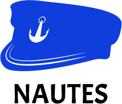
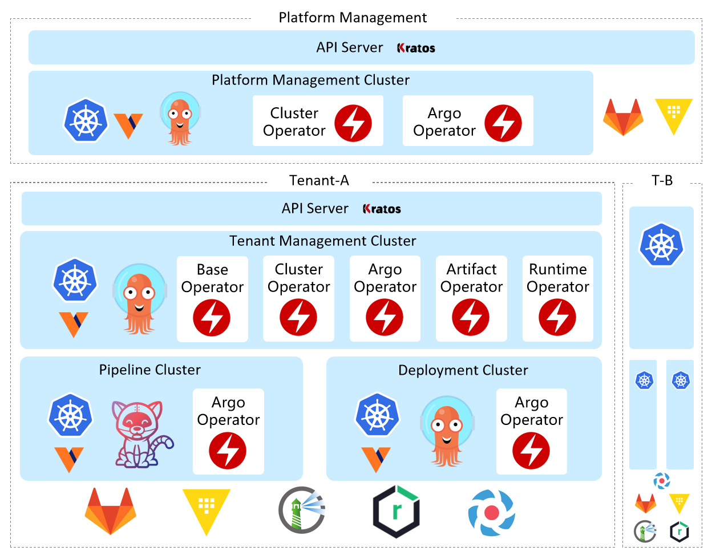
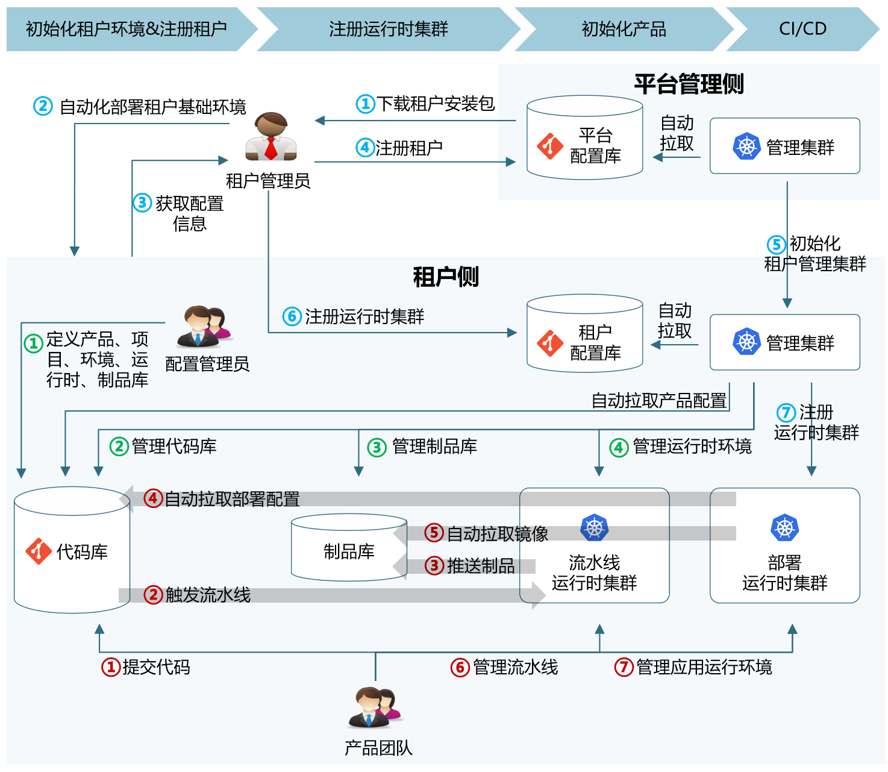

## What is Nautes?  
> English | [中文](README_zh.md)

Nautes is a Kubernetes-native all-in-one Internal Developer Platform that combines the concepts and best practices of DevOps and GitOps. It integrates the industry's best cloud-native open-source projects in a pluggable manner.

> The current version is for demonstration or trial purposes only, and its features are still being continuously improved. It is not recommended for use in production environments.

## Features
- a Kubernetes-native all-in-one Internal Developer Platform that covers the entire process, including agile development, CI/CD, automated testing, security, and operations.
- Following GitOps best practices, the version control repository serves as the single source of truth. When data in the repository changes, the Operator automatically detects the changes and performs incremental updates to the Kubernetes cluster. 
- A fully distributed multi-tenant architecture, where tenants serve as distributed computing and storage units that support horizontal scaling. The resources managed by tenants also support horizontal scaling. 
- Good adaptability, apart from the base Kubernetes and Git, other components can be replaced. 
- All features offer declarative REST APIs, allowing for secondary development. 
- For all integrated open-source projects, their native features are maintained without any trimmed encapsulation, ensuring that there is no secondary binding for the managed applications. 
- By constructing a higher-level data model, unified authentication and authorization are achieved for all integrated open-source projects.
- Supports deployment modes for private cloud and hybrid cloud. 

## Architecture

Nautes adopts a fully distributed multi-tenant architecture, where the platform management cluster is responsible for tenant allocation and recovery. Each tenant has exclusive access to a set of resources, including code repositories, key repositories, artifact repositories, authentication servers, and clusters. Resources within a tenant are managed by the tenant management cluster. 

Tenants serve as the unit of resource management and can be divided based on the organization's characteristics, such as by product teams, departments, or subsidiaries. 

Resources within a tenant can also be deployed with multiple instances, for example, multiple Harbor instances can be deployed within a single tenant to isolate container image data for different products. 

## Core Functions

The main processes and roles involved in Nautes are as follows:

**Tenant Manager:** Responsible for managing the resource components within a tenant, such as registering clusters and artifact repositories.  
**Configuration Manager:** Responsible for managing the environment and resources required by the IT system during development and operation, such as maintaining product metadata, creating code repositories, assigning artifact repositories, and defining runtime environments.  
**Product Team:** Uses the platform to develop and operate the IT system, such as submitting code, uploading dependencies, configuring pipelines, conducting exploratory testing, and so on.

## Entity Definition

- **Product:** Corresponds to a software system, including teams, projects, environments, code repositories, artifact repositories, and runtime. A product can be authorized by the Tenant Manager for use on specified Kubernetes clusters. 
- **Project:** Corresponds to a microservice, and each project has its own code repository. You can use a cluster for project integration and deployment, or use the artifact repository of the product to store and version control the project artifacts. A product can contain multiple projects.
- **Environment:** Uses a cluster (currently only supports Kubernetes) as the management unit for integrating and deploying various projects within a product. A product contains multiple environments, such as development, testing, pre-production, and production environments.
- **Code Repository:** A repository used for storing a project's source code, pipeline configurations, or deployment manifests. Only Git is supported. 
- **Pipeline Runtime:** The configuration declaration defining the aspects for integrating a project's pipeline, such as: the storage location of pipeline configurations, the pipeline's triggering method, the target environment for running the pipeline, etc. 
- **Deployment Runtime:** The configuration declaration defining the aspects for deploying projects, such as: the storage location of deployment manifests, the target environment to deploy to, etc. 

## Core Components

Nautes consists of the following components: 

  
<b>👤 Base Operator</b>

Handles the synchronization of product entities and permission entities from the provider to the target service. Learn more. <a href="https://github.com/nautes-labs/base-operator">了解更多</a>。 

  
<b>🖥️ Cluster Operator</b>

Provides a Controller for reconciling Cluster resource events, mainly managing the key information of the Kubernetes clusters declared by the Cluster resources, enabling other components involved in cluster management to correctly obtain the cluster's keys from the tenant's key management system. <a href="https://github.com/nautes-labs/cluster-operator">了解更多</a>。 

  
<b>🔗 Argo Operator</b>

 Provides a set of Controllers for reconciling Cluster resource events and CodeRepo resource events, mainly synchronizing the Kubernetes clusters declared by the Cluster resources and the code repositories declared by the CodeRepo resources to the ArgoCD in the same cluster, enabling Applications in ArgoCD using these Kubernetes clusters and code repositories to work properly. <a href="https://github.com/nautes-labs/argo-operator">了解更多</a>。 

  
<b>⚙️ Runtime Operator</b>

 Provides a set of Controllers for reconciling Project Pipeline Runtime resource events and Deployment Runtime resource events, mainly synchronizing the basic environment required for pipeline execution or application deployment on the target cluster according to the declaration information of the two types of runtime resources. <a href="https://github.com/nautes-labs/runtime-operator">了解更多</a>。 

  
<b>🤖 Installer</b>

 Provides a one-click deployment feature, supporting automated installation of infrastructure, resource components, management components, and component initialization. <a href="https://github.com/nautes-labs/installer">了解更多</a>。 

  
<b>🌐 API Server</b>

 Nautes follows GitOps best practices, with user application environment and Nautes' own environment configuration declarations stored in version repositories. Declaration data is divided into two categories: key data is stored in Vault, while other data is stored in Git repositories(currently only supports GitLab) . The API Server project provides a set of REST APIs for operating these configuration declarations. <a href="https://github.com/nautes-labs/api-server">了解更多</a>。 

  
<b>➡️ CLI</b>

 Provides a simple command-line tool by encapsulating the API Server's REST API, simplifying the user's use of the API. <a href="https://github.com/nautes-labs/cli">了解更多</a>。 

## Installation

Nautes supports installation on public cloud, private cloud, host, and Kubernetes clusters. You can learn how to install Nautes with one click on Alibaba Cloud [here](https://nautes.io/guide/user-guide/installation.html).

## Quick start

We offer [a brief guide](https://nautes.io/guide/user-guide/deploy-an-application.html) that can help you quickly deploy your first application with ease. 