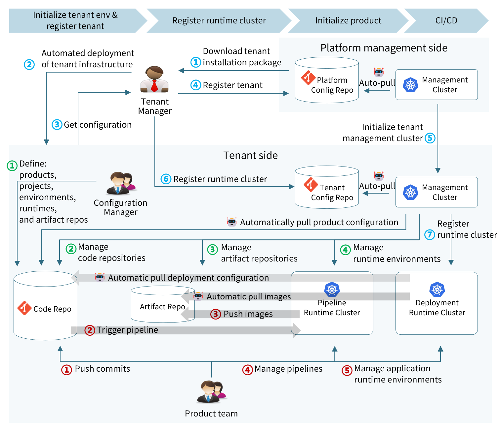

> [English](README_en.md) | 中文

## Nautes 是什么？

Nautes 是 Kubernetes 原生的开源一站式开发者平台，融合了 DevOps 和 GitOps 的理念和最佳实践，以可插拔的方式集成了业界最优秀的云原生开源项目。

> 当前版本仅用于演示或试用，功能还在不断完善中，不建议用在生产环境。

## 特性

- 覆盖敏捷开发、CI/CD、自动化测试、安全、运维等全流程的一站式开发者平台。
- 遵循 GitOps 最佳实践，以版本库作为唯一可信数据源。当版本库中的数据有变更时，由 Operator 自动识别变更并向 Kubernetes 集群做增量更新。
- 全分布式的多租户架构，租户作为分布式的计算单元和存储单元支持水平扩展，租户所管理的资源同样支持水平扩展。
- 良好的适配性，除了底座 Kubernetes 以及 Git 外，其他组件均可被替换。
- 所有功能均提供声明式的REST API，支持二次开发。
- 对所集成的开源项目，均保持其原生特性，无裁剪式封装，对受管应用不产生二次绑定。
- 通过构建上层数据模型，实现对所集成的开源项目的统一认证、统一授权。
- 支持私有云、混合云的部署模式。

## 架构

Nautes 采用全分布式的多租户架构，平台管理集群负责租户的分配和回收，每个租户独占一套资源（包括代码库、密钥库、制品库、认证服务器、集群等），租户内的资源由租户管理集群进行管理。

租户作为资源的管理单元，可由用户根据自身组织特性进行划分，常见的划分方式有：按产品团队、按部门、按子公司等。

租户内的资源也支持多实例部署，例如：可以在一个租户内部署多个 Harbor 实例，用于隔离不同产品的容器镜像数据。

## 主体功能

Nautes 的主体流程以及参与角色如下：

**租户管理员**：负责管理租户内的资源组件，如注册集群、接入制品库等。

**配置管理员**：负责管理IT系统在开发和运行过程中所需的环境和资源，如维护产品基础数据、创建代码库、分配制品库、定义运行时等。

**产品团队**：使用平台功能进行IT系统的研发和运行，如提交代码、上传依赖包、配置流水线、探索性测试等。

## 实体定义

- **产品**：对应一个软件系统，包含团队、项目、环境、代码库、制品库、及运行时。产品可以被租户管理员授权使用指定的 Kubernetes 集群。
- **项目**：对应一个微服务，每个项目有自己的代码库。您可以使用集群进行项目的集成和部署，也可以使用产品的制品库对项目的制品进行存储和版本管理。 一个产品下可以包含多个项目。
- **环境**：使用集群（目前只支持 Kubernetes集群）来承载产品中各个项目的集成和部署的管理单元。一个产品包含多个环境，如：开发环境、测试环境、预生产环境和生产环境等。
- **代码库**：用于存储项目的源代码、流水线配置、部署清单的版本库。只支持 Git。
- **流水线运行时**：定义用于集成项目的流水线的配置声明，如：流水线配置的存储位置、流水线的触发方式、运行流水线的目标环境等。
- **部署运行时**：定义用于部署项目的配置声明，如：部署清单的存储位置、部署到的目标环境等。

## 核心组件

Nautes 主要包含以下组件：

  
<b>👤 Base Operator</b>

  处理产品实体和权限实体从提供者到目标服务的同步。<a href="https://github.com/nautes-labs/base-operator">了解更多</a>。

  
<b>🖥️ Cluster Operator</b>

  提供了一个用于调谐 Cluster 资源事件的 Controller，调谐内容主要是管理 Cluster 资源所声明的 Kubernetes 集群的密钥信息，使参与集群管理的其他组件可以从租户的密钥管理系统中正确获取到集群的密钥。<a href="https://github.com/nautes-labs/cluster-operator">了解更多</a>。

  
<b>🔗 Argo Operator</b>

  提供了一组用于调谐 Cluster 资源和 CodeRepo 资源事件的 Controller，调谐内容主要是将 Cluster 资源所声明的 Kubernetes 集群和 CodeRepo 资源所声明的代码库同步到同集群的 ArgoCD 中，使 ArgoCD 中使用了这些 Kubernetes 集群和代码库的 Application 可以正常工作。<a href="https://github.com/nautes-labs/argo-operator">了解更多</a>。

  
<b>⚙️ Runtime Operator</b>

  提供了一组用于调谐 Project Pipeline Runtime 资源和 Deployment Runtime 资源事件的 Controller，调谐内容主要是根据两类运行时资源的声明信息，在目标集群上同步流水线执行或应用部署所需的基础环境。<a href="https://github.com/nautes-labs/runtime-operator">了解更多</a>。

  
<b>🤖 Installer</b>

  提供了一键部署功能，支持基础设施、资源组件、管理组件、以及各组件初始化的自动化安装。<a href="https://github.com/nautes-labs/installer">了解更多</a>。

  
<b>🌐 API Server</b>

  Nautes 的设计是遵循了 GitOps 的最佳实践，用户应用环境以及 Nautes 自身环境的配置声明均存储在版本库中。声明数据分为两类：密钥数据是存储在 Vault 中，其他数据是存储在 Git（目前只支持 GitLab）仓库中，API Server 项目则提供了一组用于操作这些配置声明的 REST API。<a href="https://github.com/nautes-labs/api-server">了解更多</a>。

  
<b>➡️ CLI</b>

  通过封装 API Server 的 REST API 提供了一个简单的命令行工具，用于简化用户使用 API 的操作。<a href="https://github.com/nautes-labs/cli">了解更多</a>。

## 安装

Nautes 支持基于公有云、私有云、主机、及 Kubernets 集群进行安装，您可以通过[这里](https://nautes.io/guide/user-guide/installation.html)了解如何在阿里云上一键安装 Nautes。

## 快速开始

我们提供了一份简要的[指南](https://nautes.io/guide/user-guide/deploy-an-application.html)，您可以通过这份指南快速部署出第一个应用。

## 路线图

我们通过这个[项目](https://github.com/orgs/nautes-labs/projects/1)提供了关于产品路线图以及进度等信息。
